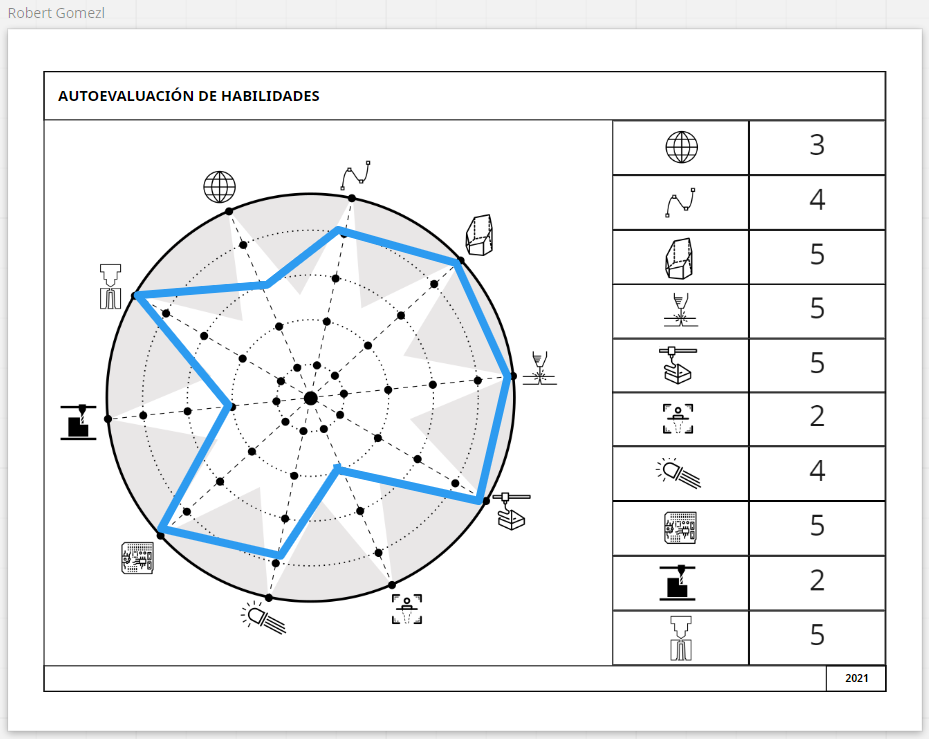

---
hide:
    - toc
---

# MT 02
## Introducción al diseño web - Herramientas digitales

El Diseño  web fue todo un desafio pq soy de la vieja escuela del trabajo diresto con editores de html y CSS trabajamos con GitLab como el repositorio y administracion de la pagina, como editor de html y css usamos Atom y una lista de comandos que los ejecutamos en la terminal de git.

